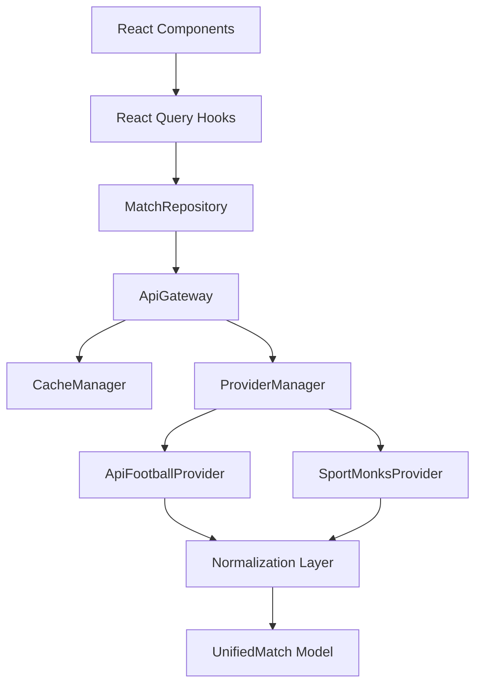
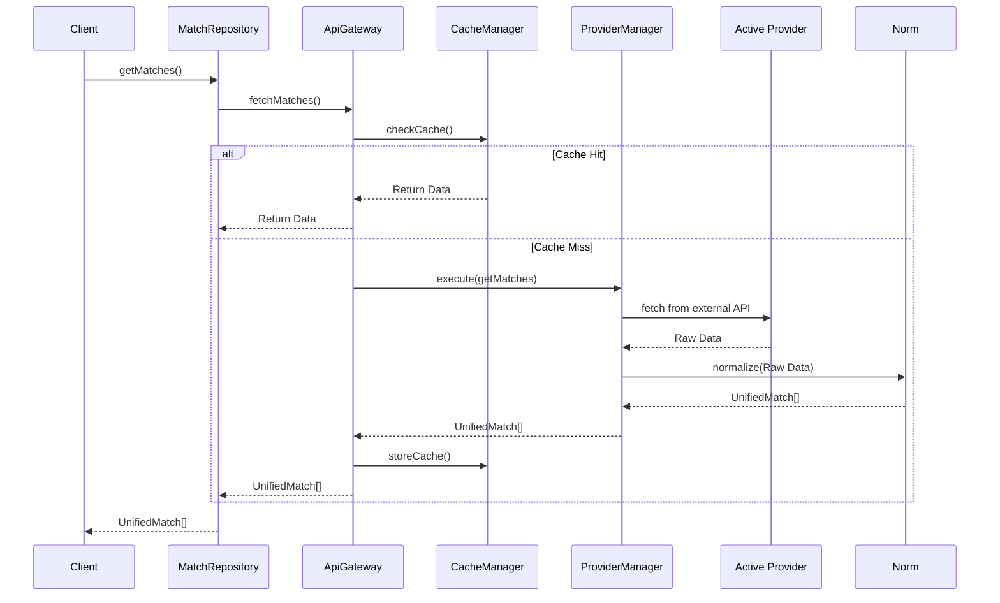

# Safara 90 - API Architecture Design

## 1. Executive Summary
This document outlines the architecture for the new unified API layer. The goal is to consolidate multiple data providers (API-Football, Football-data, SportMonks) behind a single API Gateway, standardizing the data model, normalization process, and caching strategy.

## 2. API Gateway Architecture
The API Gateway serves as the single entry point for all match-related data requests within the application.
- **Client Application** ➔ **MatchRepository** ➔ **ApiGateway** ➔ **ProviderManager** ➔ **[Active Provider]**
- The Gateway abstracts away the complexity of multiple data sources. No component outside the API layer is allowed to directly call a Provider.

## 3. Provider System
The Provider System is designed to be plug-and-play.
- **ProviderManager**: Manages the lifecycle of providers, selects the active provider based on configuration (or admin settings), and implements fallback logic if the primary provider fails.
- **Supported Providers**: 
  - `ApiFootballProvider`
  - `FootballDataProvider`
  - `SportMonksProvider`
- Future providers can be added simply by implementing the `IProvider` interface.

## 4. Unified Provider Interface (`IProvider`)
```typescript
export interface IProvider {
  id: string;
  name: string;
  priority: number;
  isActive: boolean;
  
  getMatches(date: string): Promise<UnifiedMatch[]>;
  getMatchDetails(matchId: string): Promise<UnifiedMatch>;
  getLiveMatches(): Promise<UnifiedMatch[]>;
  getStandings(leagueId: string): Promise<any>;
}
```

## 5. Unified Match Model
A single, highly structured model (`UnifiedMatch`) will replace all current disparate match models (`NormalizedMatch`, `Match`, etc.).
```typescript
export interface UnifiedMatch {
  id: string;
  providerId: string; // The ID from the source (e.g. api-football ID)
  homeTeam: Team;
  awayTeam: Team;
  score: MatchScore;
  status: MatchStatus;
  league: League;
  startTime: string; // ISO 8601
  isLive: boolean;
  minute?: number;
  events?: MatchEvent[];
  lineups?: Lineup[];
  stats?: MatchStats[];
}
```

## 6. Single Normalization Layer
The `MatchNormalizer` will be the only place where raw data from providers is transformed into the `UnifiedMatch` model.
- Each Provider will have its own internal adapter (e.g., `ApiFootballAdapter`) that maps raw responses to `UnifiedMatch`.
- The rest of the app only ever sees `UnifiedMatch`.

## 7. Unified Cache Architecture
Caching will be implemented in a multi-tiered approach without conflicts:
1. **React Query (Client-side memory)**: Manages UI state, deduplicates in-flight requests, TTL ~ 1-5 minutes.
2. **Local Storage (Client-side persistence)**: Caches static data (leagues, historical matches) to allow offline viewing and instant load.
3. **Memory Cache (Server-side)**: Fast RAM cache on the Node.js backend to serve concurrent users instantly.
4. **Firestore (Server-side persistence)**: Stores normalized AI content and historical data to prevent hitting external APIs multiple times.

## 8. Admin API Manager
An Admin API Manager module will read and write to `system_settings` in Firestore.
- **Features**: Update API Keys, toggle providers on/off, change provider priority (e.g., fallback to SportMonks if API-Football is down), and adjust cache TTLs dynamically.

## 9. Dependency Diagram


## 10. Data Flow Diagram


## 11. New Folder Structure
```
src/core/api-v2/
├── gateway/
│   └── ApiGateway.ts
├── providers/
│   ├── IProvider.ts
│   ├── ProviderManager.ts
│   ├── ApiFootballProvider.ts
│   └── SportMonksProvider.ts
├── models/
│   └── UnifiedMatch.ts
├── normalization/
│   └── MatchNormalizer.ts
├── cache/
│   └── CacheManager.ts
└── config/
    └── ApiConfig.ts
```

## 12. Migration Plan
1. **Phase 1 (Foundation)**: Create the `api-v2` directory, interfaces, models, and ProviderManager. No existing code is touched.
2. **Phase 2 (Implementation)**: Implement `ApiFootballProvider` using existing logic but conforming to the new interfaces.
3. **Phase 3 (Routing & Testing)**: Point `MatchRepository` to use `ApiGateway` in a feature branch or behind a feature flag.
4. **Phase 4 (Cleanup)**: Once stable, remove old `worldCupService`, `openFootballService`, and legacy API files.

## 13. Execution Phases (To prevent breaking the project)
- **Step 1**: Scaffold `src/core/api-v2/` and verify TypeScript compilation.
- **Step 2**: Implement the unified interfaces without altering the existing repositories.
- **Step 3**: Create the adapters for existing providers.
- **Step 4**: Switch `useMatchesV2` and `MatchRepositoryV2` to use the new Gateway.
- **Step 5**: Delete old unused services (`apiFootballMapper.js`, `statsMapper.js`, etc.).
